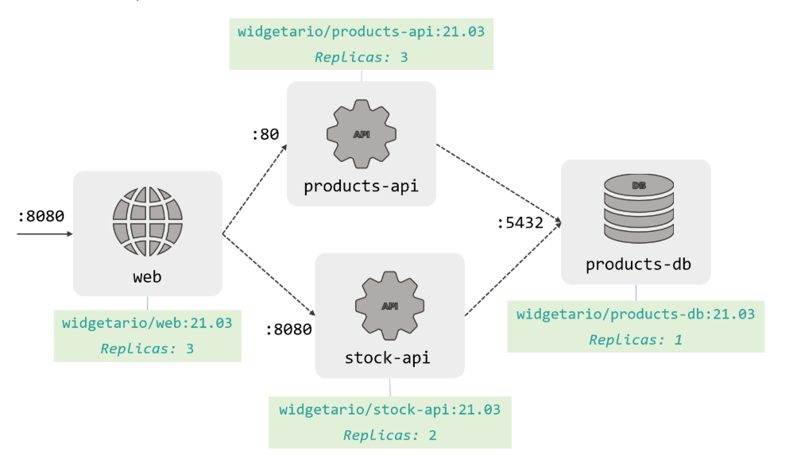
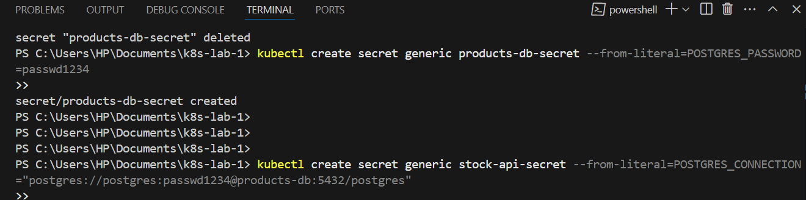
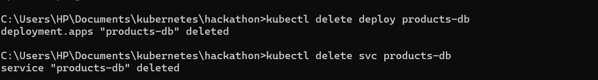
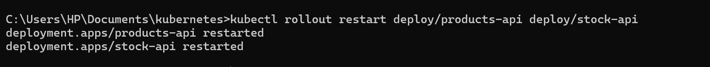
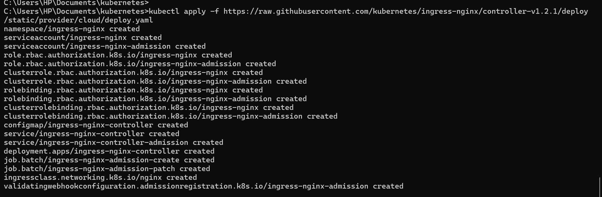
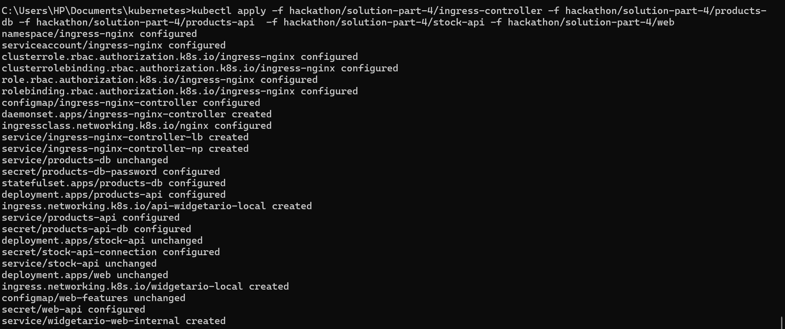
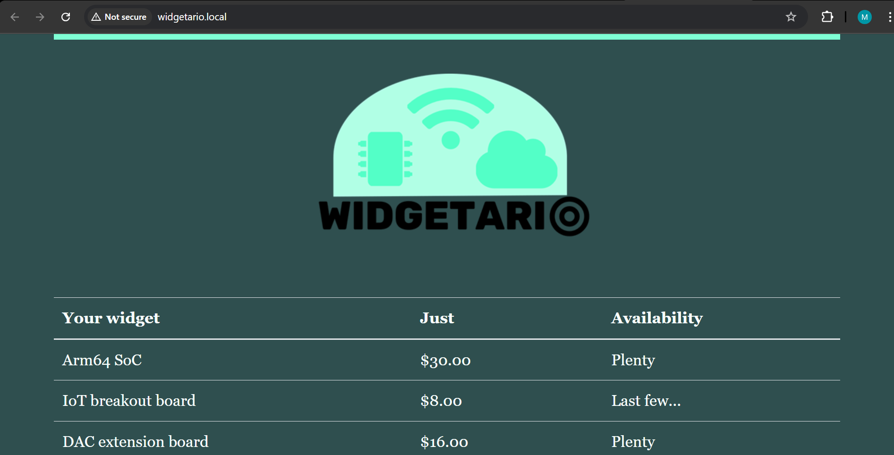

# Kubernetes Hackathon

## Part 1
- [ ] Run Public Web App on Kubernetes
- [ ] Modelled the YAML based on the architecture image: 
- [ ] Can browse to the service port from one's cluster

## Part 2

## part 3
 
 
## part 4
 
 

