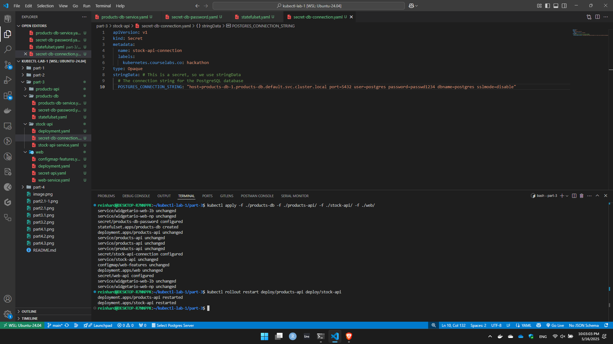
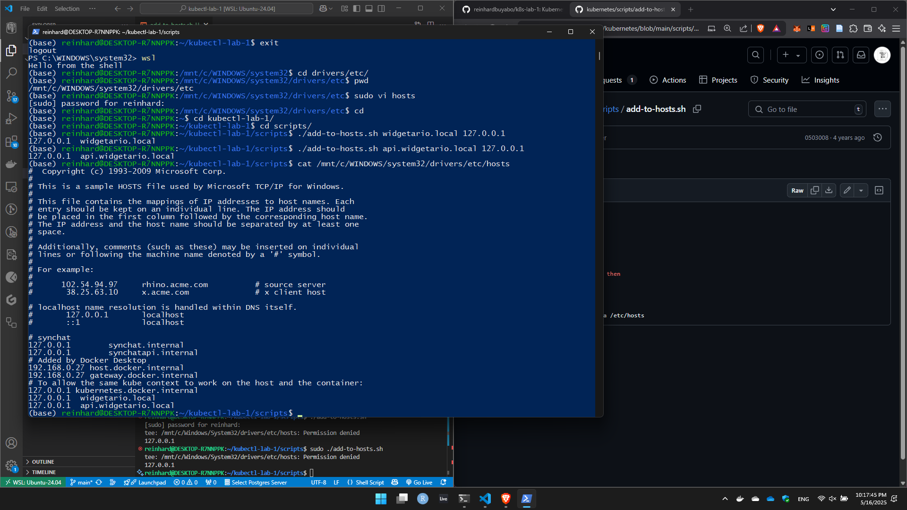
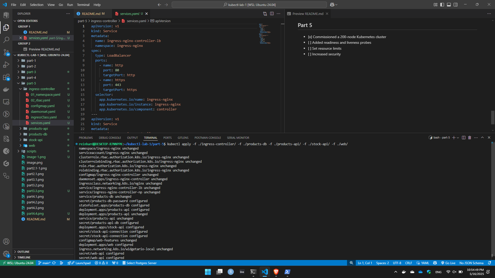

# Kubernetes Hackathon

## Part 1
- [ ] Run Public Web App on Kubernetes
- [ ] Modelled the YAML based on the architecture image: 
- [ ] Can browse to the service port from one's cluster

## Part 2

## part 3
 
 

## part 4
 
 

- [ ] Updating Host's File:

## Part 5
- [x] Commissioned a 200-node Kubernetes cluster 
- [ ] Added readiness and liveness probes
- [ ] Set resource limits
- [ ] Increased security
